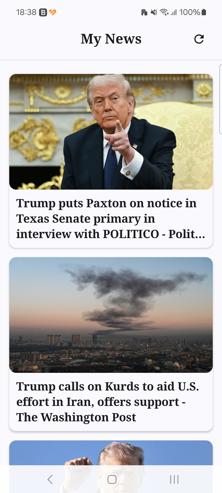

# My News — Android App

A Kotlin/Compose Android application that displays top news headlines from [NewsAPI](https://newsapi.org), adapting results to the device's locale with an automatic fallback cascade.

---

## Screenshots

| Main Screen | Detail Screen |
|:-----------:|:-------------:|
|  |  |

---

## Screens

### MainScreen — Headlines List

Displays a scrollable list of news cards. Each card shows:

- **Image** (`urlToImage`) — full-width hero thumbnail
- **Title** (`title`) — up to 3 lines, ellipsized if longer

Tapping a card navigates to the DetailScreen.

### DetailScreen — Article Detail

Full article view. Displays:

- **Title** — above the image, bold serif font
- **Image** — full-width hero image (240 dp height)
- **Source** + **Author** — pill tag + label row below the image
- **Body text** — `content` field preferred over `description`; the API truncation marker `[+N chars]` is automatically removed
- **"Read the full story"** link — opens the original article URL in the device browser

---

## UI Design Decisions

**Why the list shows only image + title**

The news list is designed for fast scanning. Showing description, author, and source in every list item increases visual noise and cognitive load. The single-focus layout (image → title) lets users quickly identify articles of interest before opening the detail view, where the full content is available.

| Screen | Content shown | Rationale |
|--------|--------------|-----------|
| MainScreen card | Image, Title | Fast scanning; minimal cognitive load |
| DetailScreen | Title, Image, Source, Author, Body, URL | Complete article context once the user has chosen to read |

---

## Features

- **Top Headlines** — loads the `top-headlines` endpoint using device locale (language + country).
- **Locale-aware fallback** — 3-step cascade ensures articles are shown even when the device language returns no results.
- **Detail screen** — hero image, cleaned body text, and a clickable link to the full article.
- **Error handling** — network errors and truly empty states show a user-friendly message with a Retry button.
- **Refresh** — tap the header icon to reload headlines.
- **Debug logging** — OkHttp `HttpLoggingInterceptor` (BODY level) active only in debug builds via `BuildConfig.ENABLE_LOGGING`.

---

## Architecture

**Clean Architecture + MVVM**

```
data/         — DTOs, Retrofit API, mappers, repository implementation
domain/       — Pure Kotlin models, repository interface, use cases
presentation/ — ViewModels, UiState, UiEvent
ui/           — Compose screens, navigation, components, theme
di/           — Hilt modules
util/         — Language detection, extensions
```

**Layer responsibilities**

| Layer | Responsibility |
|---|---|
| `ui` | Renders state; dispatches events to ViewModel |
| `presentation` | Manages UI state via StateFlow; delegates to use cases |
| `domain` | Business logic use cases; pure Kotlin, no Android deps |
| `data` | Network calls, DTO mapping; implements domain repository |

---

## NewsAPI — `top-headlines` Endpoint

The app calls the following endpoint:

```
GET https://newsapi.org/v2/top-headlines
    ?country={country}
    &language={language}   ← omitted when using country-only fallback
    &pageSize=20
    &apiKey={key}
```

> **Note:** NewsAPI does not allow combining `sources` with `country` or `language`.
> The app uses `country` + optional `language` for locale personalisation.

---

## Supported Languages by NewsAPI

The `language` parameter of `top-headlines` accepts the following codes:

```
ar  de  en  es  fr  he  it  nl  no  pt  ru  sv  ud  zh
```

Any device language outside this list is automatically mapped to `"en"` (see `util/LanguageProvider.kt`).

---

## Languages That Can Return an Empty List

Even for a **supported** language code, NewsAPI may return:

```json
{ "status": "ok", "totalResults": 0, "articles": [] }
```

This is **not** an API error — it is a valid 200 response meaning no articles are currently indexed for that combination of `language` + `country`.

Observed combinations that can return empty results (non-exhaustive):

| language | country | Notes |
|----------|---------|-------|
| `fr` | `fr` | Returns 0 results intermittently |
| `he` | `il` | Low article volume |
| `ud` | — | Rarely populated |
| `zh` | `cn` | Restricted access on free tier |

The app handles this transparently via an automatic fallback cascade (see below).

---

## Locale Fallback Cascade

When the initial call returns an empty article list, `GetTopHeadlinesUseCase` retries automatically — **at most 3 network calls per refresh**:

```
Attempt 1  country=<deviceCountry>  language=<deviceLanguage>
               ↓  articles == empty?
Attempt 2  country=<deviceCountry>  (language param omitted)
               ↓  articles == empty?
Attempt 3  country=us               language=en
               ↓  return result (empty or not — cascade ends here)
```

The cascade stops as soon as a non-empty result is returned. If all 3 attempts return empty, the UI shows **"No articles available right now."** with a Retry button that restarts the cascade from attempt 1.

**Implementation location:** `domain/usecase/GetTopHeadlinesUseCase.kt`

> The use case is the correct layer for this business logic: it decides *which parameters to try*, while the repository remains a simple API gateway and the ViewModel knows nothing about locale.

---

## Language / Country Detection

`util/LanguageProvider.kt` reads the device locale and validates it against the NewsAPI-supported sets:

```kotlin
fun getLanguage(): String {
    val lang = Locale.getDefault().language.lowercase()
    return if (lang in supportedLanguages) lang else "en"
}

fun getCountry(): String {
    val country = Locale.getDefault().country.lowercase()
    return if (country in supportedCountries) country else "us"
}
```

`LanguageProvider` is injected into `GetTopHeadlinesUseCase` (not the ViewModel), keeping locale logic entirely in the domain layer.

---

## Library Choices

| Library | Version | Why chosen |
|---|---|---|
| **Hilt** | 2.59.2 | Android-standard DI; compile-time safety; excellent IDE integration |
| **Moshi** | 1.15.2 | Lightweight codegen; excellent null-safety error messages; good Kotlin fit |
| **Retrofit** | 3.0.0 | Standard REST client; seamless Moshi converter |
| **OkHttp** | 5.3.2 | HTTP logging interceptor (debug-only); connection pooling |
| **Coil** | 2.7.0 | Compose-native image loading; suspend-based; lighter than Glide on Compose |
| **Navigation Compose** | 2.9.7 | Back-stack management; SavedStateHandle integration for nav args |
| **Coroutines + Flow** | 1.10.2 | Structured concurrency; reactive UI state with StateFlow |
| **Turbine** | 1.2.1 | Flow testing utility from CashApp |
| **MockK** | 1.14.9 | Kotlin-idiomatic mocking |
| **KSP** | 2.3.5 | Fast code generation for Hilt and Moshi; AGP 9.0 built-in Kotlin compatible |

---

## Dependency Management

Using **Gradle Version Catalog** (`gradle/libs.versions.toml`):
- All versions centralised in `[versions]`.
- All library declarations in `[libraries]`.
- Plugin declarations in `[plugins]`.
- No raw version strings in `build.gradle.kts` files.

---

## Configuration

### NewsAPI Key

The API key and base URL are read from `local.properties` (never committed to version control):

```properties
API_KEY=your_newsapi_key_here
URL=https://newsapi.org/v2/
```

They are exposed to the app via `BuildConfig` fields defined in `app/build.gradle.kts`:

```kotlin
buildConfigField("String", "NEWS_API_KEY",  "\"${localProperties["API_KEY"]}\"")
buildConfigField("String", "NEWS_BASE_URL", "\"${localProperties["URL"]}\"")
```

---

## Build & Run

### Prerequisites
- Android Studio Hedgehog or newer
- JDK 11+
- An emulator or physical device running Android 8.0+ (API 26)

### Steps

1. Clone the repository.
2. Create `local.properties` at the project root:
   ```properties
   sdk.dir=/path/to/your/android/sdk
   API_KEY=your_newsapi_key
   URL=https://newsapi.org/v2/
   ```
3. Open in Android Studio and wait for Gradle sync.
4. Run on your target device: **Run > Run 'app'**

### Build Commands

```bash
# Assemble debug APK
./gradlew clean assembleDebug

# Run unit tests
./gradlew test

# Install on connected device
./gradlew installDebug
```

---

## Unit Tests

### Running the tests

```bash
./gradlew test
```

### Test classes

| File | Layer | What is tested |
|------|-------|---------------|
| `ArticleDtoMapperTest` | data/mapper | DTO → domain mapping; null fields → empty strings; `[Removed]` filtering; blank URL rejection |
| `NewsRepositoryImplTest` | data/repository | DTO list mapping; `[Removed]` article filtering end-to-end |
| `GetTopHeadlinesUseCaseTest` | domain/usecase | 3-step fallback cascade: locale → country-only → US/EN; all-empty path |
| `MainViewModelTest` | presentation | Loading/Success/Error/Empty states; Refresh event; state ordering via Turbine |
| `DetailViewModelTest` | presentation | Article deserialization from `SavedStateHandle` nav arg (JSON round-trip) |
| `LanguageProviderTest` | utils | Language validation + fallback to `"en"`; country validation + fallback to `"us"`; Hebrew/Israel; empty tags |
| `ExtensionsTest` | utils | `IOException` → network message; generic exception with message; blank/null message → fallback |

### Test infrastructure

- **`MainDispatcherRule`** — replaces `Dispatchers.Main` with `StandardTestDispatcher` for coroutine control
- **`TestFixtures.kt`** — `fakeArticle(...)` factory with sensible defaults for concise test setup
- **MockK** for mocking dependencies; **Turbine** for Flow emission assertions

---

## Project Structure

```
app/src/main/java/com/yaropaul/mynews/
├── MyNewsApplication.kt
├── MainActivity.kt
├── data/
│   ├── remote/
│   │   ├── api/          NewsApiService (Retrofit)
│   │   ├── dto/          JSON DTOs (Moshi)
│   │   └── mapper/       DTO → domain model
│   └── repository/       NewsRepositoryImpl
├── domain/
│   ├── model/            Article (pure Kotlin)
│   ├── repository/       NewsRepository interface
│   └── usecase/          GetTopHeadlinesUseCase (+ fallback cascade)
├── presentation/
│   ├── main/             MainViewModel, MainUiState, MainUiEvent
│   └── detail/           DetailViewModel, DetailUiState
├── ui/
│   ├── components/       ArticleImage, CategoryPillTag, LoadingView, ErrorView
│   ├── navigation/       AppNavGraph, NavRoutes, ArticleNavType, ArticleNavDto
│   ├── screen/
│   │   ├── main/         MainScreen, NewsCard, NewsListContent
│   │   └── detail/       DetailScreen, DetailContent
│   └── theme/            Color, Type, Theme
├── di/                   NetworkModule, RepositoryModule
└── util/                 LanguageProvider, Extensions
```

---

## Known Limitations

| Area | Notes |
|---|---|
| **Content truncation** | NewsAPI free tier truncates `content` at ~200 chars. The app cleans the `[+N chars]` marker and links to the full article. |
| **Pagination** | Only first page (20 articles) loaded. No Paging 3 integration. |
| **HTTP cache** | No OkHttp cache or ETag handling. Each refresh is a full network round-trip. |
| **Offline mode** | Articles are not cached locally. No offline reading. |
| **Rate limiting** | NewsAPI free tier = 100 req/day. No retry/backoff strategy on 429 errors. |
| **Article search** | Only `top-headlines` endpoint; no keyword search. |
| **Pull-to-refresh** | Refresh via the header icon only; no swipe-to-refresh gesture. |
